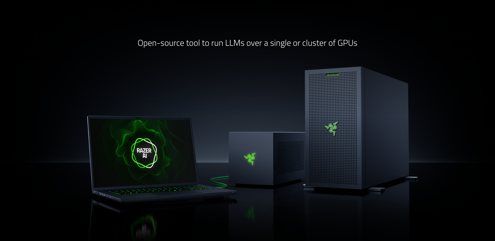
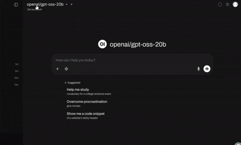
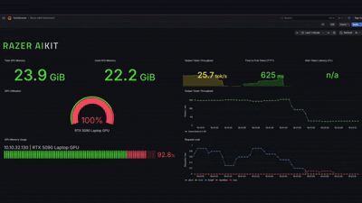
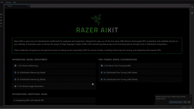

<div align="center">

# RAZER AIKIT


[](https://github.com/razerofficial/aikit/releases)
[](https://hub.docker.com/r/razerofficial/aikit)
[](LICENSE)
[](docs/)



[🚀 Quick Start](#quick-start) • [📖 Documentation](docs/) • [🛠️ Contributing](CONTRIBUTING.md)

</div>

---

> **⚠️ Preview Release**
> 
> Razer AIKit is in preview. Features may change or have limitations before stable release. We appreciate your feedback!

---

## What is Razer AIKit?

**Open-source AI development environment** for engineers and researchers. Delivers cloud-grade performance and scalability directly on your desktop with out-of-the-box setup.

### Technical Stack

- **AIKit CLI** - Command-line interface for model lifecycle management
- **vLLM Engine** - Production-grade LLM inference with memory optimization
- **LlamaFactory** - Parameter-efficient fine-tuning framework  
- **Ray** - Distributed computing for seamless multi-GPU scaling

##  Core Features

<table>
<tr>
<td width="50%" align="center">


### 🎨 **AI Image Generation**
Run iterative image generation locally - craft creative prompts and refine results in real time with zero cloud dependency.

</td>
<td width="50%" align="center">



### 🎯 **Production-Ready Text Generation**
Instantly test any model through our built-in Open WebUI  - select, prompt, and iterate without any extra setup.

</td>
</tr>
<tr>
<td width="50%" align="center">



### 🌐 **Intelligent Multi-GPU Scaling**
Monitor live GPU load in Grafana and seamlessly scale from one overloaded GPU to a full multi-GPU cluster.

</td>
<td width="50%" align="center">



### 🚀 **Local-First AI Development**
Explore 300,000+ models on-device - launch AIKit, open Jupyter Lab, and follow step-by-step notebook guides to run your first model locally.

</td>
</tr>
</table>

---

##  Quick Start


### Prerequisites

<details>
<summary><b>Windows 11</b></summary>

> **Note**: Razer AIKit runs inside WSL 2 on Windows for optimal performance and compatibility.

- **NVIDIA GPU Driver** - Install [NVIDIA App](https://www.nvidia.com/en-us/software/nvidia-app/) and select **Studio Driver** for best stability
- **WSL 2** - [Microsoft's guide](https://docs.microsoft.com/en-us/windows/wsl/install) 
  - Install 24.04 distribution
  - Configure networking mode to **Mirrored** in WSL Settings
  - **Configure Windows Firewall for WSL**: Run the following command in PowerShell as Administrator to allow incoming connections to WSL:
    ```powershell
    Set-NetFirewallHyperVVMSetting -Name '{40E0AC32-46A5-438A-A0B2-2B479E8F2E90}' -DefaultInboundAction Allow
    ```
    
- **Docker Engine (WSL)** - [Install guide](https://docs.docker.com/engine/install/ubuntu/)
- **NVIDIA Container Toolkit (WSL)** - [Installation instructions](https://docs.nvidia.com/datacenter/cloud-native/container-toolkit/latest/install-guide.html)

Verify installation:
```bash
nvidia-smi
```

</details>

<details>
<summary><b>Ubuntu 22.04 / 24.04</b></summary>

- **Docker Engine** - [Install guide](https://docs.docker.com/engine/install/ubuntu/)
- **NVIDIA GPU Driver** - Install via `Software & Updates > Additional Drivers`
- **NVIDIA Container Toolkit** - [Installation instructions](https://docs.nvidia.com/datacenter/cloud-native/container-toolkit/latest/install-guide.html)

Verify installation:
```bash
nvidia-smi
```

</details>

### ⚡ Quick Start & Your First Model

```bash
# Create huggingface cache directory if it doesn't exist
mkdir -p $HOME/.cache/huggingface

# Pull and run Razer AIKIT
docker run -it \
  --restart=unless-stopped \
  --gpus all \
  --ipc host \
  --network host \
  --mount type=bind,source=$HOME/.cache/huggingface,target=/home/Razer/.cache/huggingface \
  --env HUGGING_FACE_HUB_TOKEN=<YOUR_TOKEN> \
  razerofficial/aikit:latest
```

Once inside the container, choose your preferred approach:

**Option 1: Start with interactive guides**
```bash
# Start Jupyter Lab for interactive guides (guides will be available at the outputted link)
jupyter lab --ip="0.0.0.0"
```
> 💡 **Tip**: Explore the `notebooks/` folder for step-by-step guides and examples!

**OR**

**Option 2: Run a model directly**
```bash
# Run a lightweight coding model
rzr-aikit model run deepseek-ai/deepseek-coder-1.3b-instruct
```

### 🔬 Advanced Mode

For production deployments and monitoring, enable the full stack with Docker Compose:

```bash
git clone https://github.com/razerofficial/aikit.git && cd aikit
mkdir -p $HOME/.cache/huggingface
export HUGGING_FACE_HUB_TOKEN=<YOUR_TOKEN>
docker compose -f docker_compose/docker-compose.yaml up -d --pull always
```

**Available Services:**

- **📓 Jupyter Lab** - Interactive notebooks with examples (`http://localhost:8888`)
- **📊 Grafana** - GPU metrics, model performance, Ray cluster stats (`http://localhost:3000`)
- **💬 Open WebUI** - Chat interface for model testing (`http://localhost:1919`)
- **🎯 Prometheus** - Metrics collection (`http://localhost:9090`)


---

## 📚 Documentation & Examples

<table>
<tr>
<td width="50%">

### 📖 **Documentation**
- [CLI Reference](docs/cli-reference.md) - Complete command reference
- [Setup Guide](docs/setup.md) - Detailed installation instructions
- [GPU Compatibility](docs/gpu-compatibility.md) - Supported GPUs and compute capabilities
- [Fine-Tuning Guide](docs/fine-tuning.md) - Model customization
- [Inference Guide](docs/inferencing.md) - Production deployment
- [Container Guide](docs/build-container.md) - Docker setup
- [Known Issues](docs/known-issues.md) - Common problems and solutions

</td>
<td width="50%">

### 💡 **Interactive Examples**
- [On-Device Inference](notebooks/1_On_Device_Inferencing.ipynb)
- [Distributed Inference](notebooks/2a_(Head)_Distributed_Inferencing.ipynb)
- [Fine-Tuning with LoRA](notebooks/3_On_Device_Fine_Tuning_LoRA.ipynb)
- [OpenAI API Integration](notebooks/5_Integrating_Razer_AIKit_with_OpenAI_API.ipynb)
- [Semantic Search](notebooks/6_Semantic_Search.ipynb)

</td>
</tr>
</table>

---

## 🖥️ Platform Support

Razer AIKit is optimized for NVIDIA accelerated computing platforms with support for both x86-64 and ARM64 architectures.

**Workstations & Development**
- **Razer Blade** - High-performance gaming laptops with GeForce RTX 50 series, RTX 40 series, RTX 30 series, and RTX 20 series
- **NVIDIA RTX Professional Workstations** - RTX PRO 6000 Blackwell, RTX 6000 Ada, RTX A series

**Data Center & Enterprise**
- **NVIDIA DGX Systems** (x86-64 and ARM64)
  - NVIDIA GB10 (DGX Spark)
  - NVIDIA GB300, GB200
  - NVIDIA GH200, GH100
- **Data Center GPUs**: B200, B300, H100, H200, A100, L4, L40, L40S

**GPU Requirements**
- **Minimum**: NVIDIA GPU with Compute Capability 7.0 (Volta) or higher
- **Supported Architectures**: Blackwell, Hopper, Ada Lovelace, Ampere, Turing, Volta
- **Detailed Information**: [GPU Compatibility Guide](docs/gpu-compatibility.md)

---

## 🏆 Contributors

We welcome contributions from the community! Special thanks to all our contributors who make this project possible.

---

## 📄 License & Acknowledgments

**Licensed under [Apache License 2.0](LICENSE)**

**Additional Resources**
- [Security Policy](SECURITY.md) - Security reporting guidelines
- [Open Source Notices](OPEN_SOURCE_NOTICES.md) - Third-party acknowledgments
- [Contributing Guidelines](CONTRIBUTING.md) - Detailed contribution instructions

---

<div align="center">

**Made with ❤️ by the Razer AI Team**

[🌟 Star us on GitHub](https://github.com/razerofficial/aikit)
</div>
